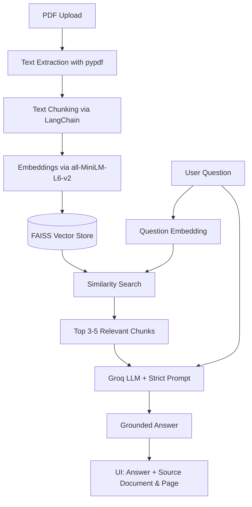

# Domain-Specific RAG Chatbot for PDF Question Answering

## 1. Project Title
Domain-Specific RAG Chatbot for PDF Question Answering

## 2. Project Objective
The goal is to create a reliable question-answering system that uses information from user-uploaded PDF documents. The chatbot retrieves the most relevant passages and generates answers strictly based on those passages, effectively preventing hallucinations.

## 3. Problem Statement
Large documents are difficult to search manually. A user may need to read many pages to find one answer. This project solves that problem by allowing users to upload multiple documents and ask questions in natural language, receiving precise answers along with the exact source document and page number.

## 4. Features
- **Upload Multiple PDFs:** Easily upload and manage multiple PDF files.
- **Accurate Document Retrieval:** Retrieves the most relevant chunks of text from uploaded documents.
- **Hallucination Prevention:** The chatbot will explicitly state if the answer cannot be found in the documents.
- **Source Attribution:** Every generated answer displays the source document name and page number.
- **Clean UI:** Simple and professional Streamlit-based web interface.

## 5. Technologies Used
- **Python:** Primary programming language.
- **Streamlit:** Frontend UI framework.
- **pypdf:** PDF text extraction.
- **LangChain:** RAG pipeline framework.
- **Sentence Transformers:** Text embeddings (`all-MiniLM-L6-v2`).
- **FAISS:** Vector Database for fast similarity search.
- **Groq API:** LLM provider (using Llama-3-8b).
- **python-dotenv:** Environment variable management.

## 6. Architecture / Workflow


## 7. Folder Structure
```
domain_rag_chatbot/
│
├── app.py                  # Main Streamlit UI
├── rag_pipeline.py         # RAG and LLM integration
├── document_loader.py      # PDF parsing and chunking
├── vector_store.py         # FAISS database operations
├── prompt.py               # Strict guardrail prompt
├── requirements.txt        # Project dependencies
├── README.md               # Project documentation
├── .env                    # Environment variables (API Key)
├── .gitignore              # Git ignore rules
│
├── documents/              # Temporary storage for uploaded PDFs
│
├── vector_store/           
│   └── saved_index/        # Local FAISS index storage
│
└── tests/
    └── test_questions.csv  # 15 sample questions for evaluation
```

## 8. Installation Steps
Follow these steps carefully to set up the project on your local machine.

## 9. Virtual Environment Setup
First, create a virtual environment to keep dependencies isolated.
Open your terminal in the `domain_rag_chatbot` folder and run:
```bash
python -m venv venv
```

Activate the virtual environment:
- **Windows:**
  ```bash
  venv\Scripts\activate
  ```
- **Linux/Mac:**
  ```bash
  source venv/bin/activate
  ```

## 10. Requirements Installation
With the virtual environment activated, install the required packages:
```bash
pip install -r requirements.txt
```

## 11. API Key Setup
You need a free API key from Groq to run the language model.
1. Go to [console.groq.com](https://console.groq.com/).
2. Create an account and navigate to API Keys.
3. Generate a new API key.

## 12. .env Configuration
1. Open the `.env.example` file in the project.
2. Rename it to `.env` or create a new file named `.env`.
3. Add your Groq API key:
   ```env
   GROQ_API_KEY=your_actual_api_key_here
   ```

## 13. How to Run the Project
Make sure your virtual environment is activated, then run:
```bash
streamlit run app.py
```
This will open the web application in your default browser.

## 13b. How to Run with Docker
Alternatively, you can run the application fully containerized using Docker:
```bash
docker build -t domain-rag-chatbot .
docker run -p 8501:8501 domain-rag-chatbot
```
Then navigate to `http://localhost:8501` in your browser.

## 14. How to Upload PDFs
1. Look at the left sidebar titled "Document Manager".
2. Click on "Browse files" or drag and drop your PDF files into the uploader.
3. Wait for the file names to appear.
4. Click the blue **"Process Documents"** button.
5. Wait for the success message before asking questions.

## 15. How to Ask Questions
1. After processing documents, go to the main chat area.
2. Type your question in the bottom text box.
3. Press Enter. The chatbot will search your documents and provide an answer with the source page.

## 16. Example Questions
If you uploaded a company handbook:
- "What is the policy for sick leave?"
- "How many vacation days do I get?"
- "Who is the CEO of Google?" (The bot should refuse to answer this if not in the document).

## 17. Testing Procedure
A test sheet is provided in `tests/test_questions.csv`. To evaluate the system:
1. Upload the relevant dummy PDFs (e.g., a dummy Policy.pdf and Handbook.pdf).
2. Ask each question from the CSV.
3. Verify if the system:
   - Retrieved the correct page.
   - Answered correctly.
   - Refused appropriately for out-of-context questions.
4. Record your findings.

## 18. Limitations
- OCR is not implemented; it cannot read scanned image-based PDFs.
- Very large documents (thousands of pages) might take longer to embed on standard CPUs.

## 19. Future Enhancements
- Add OCR support for scanned documents using Tesseract.
- Implement user authentication and document access control.

## 20. GitHub Upload Instructions
To upload this project to GitHub:
```bash
git init
git add .
git commit -m "Initial commit: Domain-Specific RAG Chatbot"
git branch -M main
git remote add origin <your-github-repo-url>
git push -u origin main
```
*Note: Make sure your `.env` file is ignored (which is already set in `.gitignore`) so your API key is not leaked.*

---

## 21. Viva Explanation

If asked to explain the project during a viva, use these simple explanations:

**1. What is RAG and why is it used?**
Retrieval-Augmented Generation (RAG) combines search with AI generation. Instead of relying on the AI's general memory (which can hallucinate or be outdated), we first search for the exact facts in our uploaded PDFs, and then ask the AI to summarize those specific facts.

**2. Why do we split documents into chunks?**
An entire 100-page PDF is too large to send to the AI at once due to context limits. Splitting it into smaller paragraphs (chunks) allows us to search and retrieve only the most relevant specific paragraphs.

**3. What is an embedding?**
An embedding is a way of converting text into a list of numbers (a vector). Sentences with similar meanings will have similar numbers. This lets the computer mathematically calculate which paragraphs match the user's question.

**4. What does a vector database store?**
It stores all our document chunks and their corresponding number vectors (embeddings). We use FAISS as our vector database because it is very fast at searching through thousands of embeddings.

**5. Why all-MiniLM-L6-v2 is used?**
It is a fast, lightweight, and efficient open-source embedding model that runs perfectly well on standard CPUs without requiring an expensive graphics card (GPU).

**6. How does similarity search work?**
When the user asks a question, we convert the question into an embedding (numbers). The vector database compares this number list to all the document number lists using mathematical similarity (Cosine Similarity) and returns the closest matches.

**7. Why are top 3-5 chunks retrieved?**
Retrieving too many chunks confuses the AI and exceeds its context limit. Retrieving too few might miss part of the answer. 3 to 5 chunks is the sweet spot for getting enough context without overwhelming the model.

**8. How the LLM generates the answer:**
We give the LLM a prompt that says "Here is the user's question, and here are 3 paragraphs from our document. Answer the question using ONLY these paragraphs." The LLM reads the paragraphs and writes a natural language answer.

**9. Why hallucination can happen?**
If an LLM doesn't know an answer, it tries to guess or invent facts to sound helpful. This is called hallucination.

**10. How the prompt prevents unsupported answers:**
Our system prompt strictly tells the LLM: "If the answer is not available in the context, say: 'I could not find this information'". This acts as a guardrail preventing it from guessing.

**11. How source pages are displayed:**
During the text extraction phase (using pypdf), we save the document name and page number as "metadata" alongside the text. When the chunk is retrieved, we extract this metadata and display it.

**12. What happens when an answer is unavailable:**
The similarity search retrieves the closest chunks, but if none of them actually contain the answer, the LLM reads them, realizes the answer isn't there, and triggers our fallback phrase: "I could not find this information in the uploaded documents."
